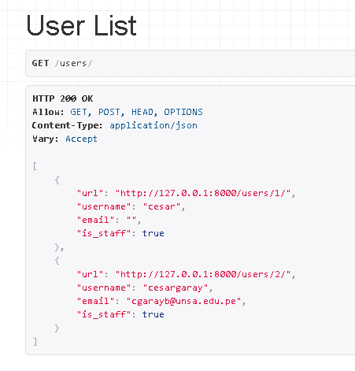

# pweb_lab07
Django rest

<html>
   <head>
      <meta content="text/html; charset=UTF-8" http-equiv="content-type">
   </head>
   <body class="c53 doc-content">
      

         

         
         <table class="c10">
            <tr class="c49">
               <td class="c13" colspan="1" rowspan="1">
                  

               </td>
               <td class="c8" colspan="1" rowspan="1">
                  
UNIVERSIDAD NACIONAL DE SAN AGUSTIN

                  
FACULTAD DE INGENIER&Iacute;A DE PRODUCCI&Oacute;N Y SERVICIOS

                  
ESCUELA PROFESIONAL DE INGENIER&Iacute;A DE SISTEMA

               </td>
               <td class="c45" colspan="1" rowspan="1">
                  

               </td>
            </tr>
            <tr class="c50">
               <td class="c55" colspan="3" rowspan="1">
                  
Formato: Gu&iacute;a de Pr&aacute;ctica de Laboratorio / Talleres / Centros de Simulaci&oacute;n

               </td>
            </tr>
            <tr class="c52">
               <td class="c13" colspan="1" rowspan="1">
                  
Aprobaci&oacute;n: &nbsp;2022/03/01

               </td>
               <td class="c8" colspan="1" rowspan="1">
                  
C&oacute;digo: GUIA-PRLE-001

               </td>
               <td class="c45" colspan="1" rowspan="1">
                  
P&aacute;gina: 

               </td>
            </tr>
         </table>
         

      

      
INFORME DE LABORATORIO

      
(formato estudiante)

      
      <table class="c10">
         <tr class="c21">
            <td class="c27" colspan="6" rowspan="1">
               
INFORMACI&Oacute;N B&Aacute;SICA

            </td>
         </tr>
         <tr class="c9">
            <td class="c17" colspan="1" rowspan="1">
               
ASIGNATURA: 

            </td>
            <td class="c30" colspan="5" rowspan="1">
               
Laboratorio - Programaci&oacute;n Web

            </td>
         </tr>
         <tr class="c9">
            <td class="c17" colspan="1" rowspan="1">
               
T&Iacute;TULO DE LA PR&Aacute;CTICA: 

            </td>
            <td class="c30" colspan="5" rowspan="1">
               
Django rest

            </td>
         </tr>
         <tr class="c9">
            <td class="c17" colspan="1" rowspan="1">
               
N&Uacute;MERO DE PR&Aacute;CTICA:

            </td>
            <td class="c40" colspan="1" rowspan="1">
               
07

            </td>
            <td class="c26" colspan="1" rowspan="1">
               
A&Ntilde;O LECTIVO:

            </td>
            <td class="c15" colspan="1" rowspan="1">
               
2022 - A

            </td>
            <td class="c15" colspan="1" rowspan="1">
               
NRO. SEMESTRE:

            </td>
            <td class="c23" colspan="1" rowspan="1">
               
III

            </td>
         </tr>
         <tr class="c9">
            <td class="c17" colspan="1" rowspan="1">
               
FECHA DE PRESENTACI&Oacute;N

            </td>
            <td class="c40" colspan="1" rowspan="1">
               
11/08/2022

            </td>
            <td class="c26" colspan="1" rowspan="1">
               
HORA DE PRESENTACI&Oacute;N

            </td>
            <td class="c44" colspan="3" rowspan="1">
               

            </td>
         </tr>
         <tr class="c9">
            <td class="c35" colspan="4" rowspan="1">
               
INTEGRANTE (s): 

               <ul class="c11 lst-kix_list_7-0 start">
                  <li class="c5 c25 c33 li-bullet-0">Garay Bedregal, C&eacute;sar Alejandro</li>
               </ul>
               

               

            </td>
            <td class="c15" colspan="1" rowspan="1">
               
NOTA:

            </td>
            <td class="c23" colspan="1" rowspan="1">
               

            </td>
         </tr>
         <tr class="c9">
            <td class="c54" colspan="6" rowspan="1">
               
DOCENTE(s):

               
Richart Smith Escobedo Quispe - rescobedoq@unsa.edu.pe

               

            </td>
         </tr>
      </table>
      

      
      <table class="c10">
         <tr class="c21">
            <td class="c27" colspan="1" rowspan="1">
               
SOLUCI&Oacute;N Y RESULTADOS

            </td>
         </tr>
         <tr class="c51">
            <td class="c32" colspan="1" rowspan="1">
               <ol class="c11 lst-kix_list_5-0 start" start="1">
                  <li class="c36 li-bullet-1">SOLUCI&Oacute;N DE EJERCICIOS/PROBLEMAS</li>
               </ol>
               <ul class="c11 lst-kix_wm0nbd1q9bzg-0 start">
                  <li class="c5 c33 c25 li-bullet-0">Creaci&oacute;n de la Api:</li>
               </ul>
               <ul class="c11 lst-kix_ij0ts3nqyxp-0 start">
                  <li class="c1 c25 li-bullet-0">Para la creaci&oacute;n del Api primero deberemos importar: djangorestframework, markdown, django.filter, que se encuentran registrados en el archivo requirements.txt.</li>
                  <li class="c1 c25 li-bullet-0">En settings.py, agregamos &lsquo;rest_framework&rsquo; y en urls.py agregamos el path que incluya lo anteriormente agregado:</li>
               </ul>
               

               

               

               <ul class="c11 lst-kix_ft3nt5qiosnu-0 start">
                  <li class="c1 c25 li-bullet-0">Creamos la representaci&oacute;n de la API agregando un modelo de usuario:</li>
               </ul>
               

               

               <ul class="c11 lst-kix_podvaat570v-0 start">
                  <li class="c1 c25 li-bullet-0">Creamos la vista del usuario (query):</li>
               </ul>
               

               

               <ul class="c11 lst-kix_xil7jw6kymdr-0 start">
                  <li class="c1 c25 li-bullet-0">Agregamos routers que autom&aacute;ticamente configurar&aacute;n las URL:</li>
               </ul>
               

               

               <ul class="c11 lst-kix_5p7fy24rpqgu-0 start">
                  <li class="c1 c25 li-bullet-0">Terminamos de agregar los path necesarios, conservamos admin para visualizar la estructura creada:</li>
               </ul>
               

               

               <ul class="c11 lst-kix_gaxksu377f9b-0 start">
                  <li class="c1 c25 li-bullet-0">Finalmente realizar los procedimientos finales de Django como es la migraci&oacute;n y la creaci&oacute;n del superusuario, a este punto makemigrations&nbsp;no es necesario.</li>
               </ul>
               

               <ul class="c11 lst-kix_1c1amrms9yma-0 start">
                  <li class="c5 c33 c25 li-bullet-0">Podemos ver con el rest creado los usuarios registrados, en este caso se muestra los superusuarios:</li>
               </ul>
               

               

               

               

            </td>
         </tr>
         <tr class="c28">
            <td class="c32" colspan="1" rowspan="1">
               <ol class="c11 lst-kix_list_5-0" start="2">
                  <li class="c36 li-bullet-1">SOLUCI&Oacute;N DEL CUESTIONARIO</li>
               </ol>
               <ul class="c11 lst-kix_list_1-0 start">
                  <li class="c5 c33 c25 li-bullet-0">No hay cuestionario</li>
               </ul>
               

            </td>
         </tr>
         <tr class="c28">
            <td class="c32" colspan="1" rowspan="1">
               <ol class="c11 lst-kix_list_5-0" start="3">
                  <li class="c36 li-bullet-2">CONCLUSIONES</li>
               </ol>
               <ul class="c11 lst-kix_list_2-0 start">
                  <li class="c5 c33 c25 li-bullet-0">Trabajar creando APIs aumenta la escalabilidad de los proyectos y a futuro implementar nuevas aplicaciones reutilizando estructuras ya creadas en la rest, como pudimos ver en este laboratorio, uno de las aplicaciones para estas rest, puede ser la creaci&oacute;n del sistema de usuarios (registro), ya que se brinda los par&aacute;metros de seguridad del framework y se agiliza la implementaci&oacute;n de este.</li>
               </ul>
            </td>
         </tr>
      </table>
      

      
      <table class="c10">
         <tr class="c21">
            <td class="c27" colspan="1" rowspan="1">
               
RETROALIMENTACI&Oacute;N GENERAL

            </td>
         </tr>
         <tr class="c28">
            <td class="c32" colspan="1" rowspan="1">
               

               

            </td>
         </tr>
      </table>
      

      
      <table class="c10">
         <tr class="c21">
            <td class="c27" colspan="1" rowspan="1">
               
REFERENCIAS Y BIBLIOGRAF&Iacute;A

            </td>
         </tr>
         <tr class="c22">
            <td class="c32" colspan="1" rowspan="1">
               

            </td>
         </tr>
      </table>
      

      

   </body>
</html>